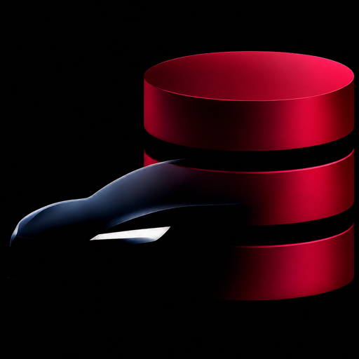
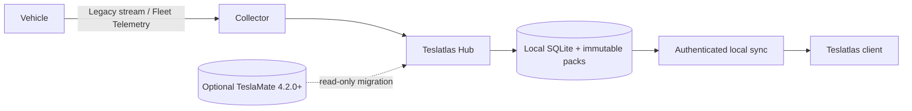

<p align="center">
  
</p>

<h1 align="center">Teslatlas Hub</h1>

<p align="center">
  A fast, self-hosted vehicle telemetry collector and local sync hub for macOS and Debian Linux.
</p>

<p align="center">
  <a href="#install">Install</a> ·
  <a href="../docs/guides/getting-started.md">Getting started</a> ·
  <a href="../docs/index.md">Documentation</a> ·
  <a href="../docs/guides/fleet-setup.md">Fleet setup</a> ·
  <a href="../docs/releases/migration.md">TeslaMate migration</a> ·
  <a href="SECURITY.md">Security</a> ·
  <a href="../docs/releases/changelog.md">Changelog</a> ·
  <a href="../CITATION.cff">Cite</a>
</p>

<p align="center">
  <sub>Created by <strong>György Bolyki</strong> · Published and maintained by <strong>MAGRATHEAN UK LTD</strong></sub>
</p>

> [!WARNING]
> **v1.0.0-beta.2 is an unpublished beta candidate.** Install only after the complete
> signed GitHub prerelease is published, and verify every required artifact. Back up Hub data,
> test recovery, and expect interfaces or storage formats to change before
> v1.0.0. Do not use Teslatlas Hub for safety-critical, emergency,
> autonomous-driving, or vehicle-control decisions.

Teslatlas Hub keeps telemetry under the operator's control. It collects every
configured vehicle, stores history in local SQLite-backed packs, and exposes a
bounded sync protocol for the separately distributed Teslatlas client. New
installations do not need TeslaMate, Grafana, or MQTT.

## Why Teslatlas Hub

| | Capability |
|---|---|
| **Local first** | Vehicle history, credentials, backups, and logs remain on the operator-controlled host. |
| **Two collection paths** | Legacy Owner API polling and streaming, or official Fleet API with native Fleet Telemetry push. |
| **Multi-vehicle** | Independent identity, collection, state, history, and commands for every configured vehicle. |
| **Native operation** | AppKit control app and LaunchAgent on Apple silicon; hardened systemd service on Debian amd64 and ARM64. |
| **Safe migration** | Optional read-only TeslaMate 4.2.0+ import with an explicit compatibility acknowledgement and stopped cutover. |
| **Built for recovery** | Integrity checks, repair, data-only backups, and separately encrypted credential recovery. |

## Architecture



The resident Hub process is the only provider-token owner. Fleet Telemetry is
received by a pinned companion receiver and forwarded over authenticated
loopback ingestion. Commands are explicit, confirmed, bounded, and routed
through the same resident credential owner. See
[Architecture](../docs/architecture/overview.md) and
[Security model](../docs/architecture/security-model.md).

## Supported platforms

| Platform | Architecture | Service | User interface |
|---|---|---|---|
| macOS 13+ | Apple silicon (`arm64`) | Per-user LaunchAgent with root-owned payload | Native AppKit app and CLI |
| Debian 13 | `amd64` | Hardened systemd units | CLI |
| Debian 13 | `arm64` | Hardened systemd units | CLI |

Other operating systems and CPU architectures are not part of the beta support
contract. Linux support is intentionally native and does not depend on AppKit,
MapKit, or another Apple framework.

## Install

Download only from the
[GitHub releases page](https://github.com/magrathean-uk/teslatlas-hub/releases).
The beta is not published if its tag page or any required evidence asset is
absent. Verify the tag, checksums, signatures, SBOM, and platform artifact
before installation; see [Verify a release](../docs/releases/verification.md).

### macOS

When the complete beta is published, expand `Teslatlas Hub.zip`, move
**Teslatlas Hub.app** to `/Applications`, and open it. The app verifies and
installs its embedded service package under
`/Library/Application Support/Teslatlas Hub`. The separately downloadable
`TeslatlasHubService.pkg` installs only the service payload; it does not install
the control app.

Open **Teslatlas Hub**, choose a new Fleet or legacy installation, or select
the guided TeslaMate migration path. The app keeps Hub stopped until setup and
diagnostics succeed.

### Debian

Choose the `.deb` matching `dpkg --print-architecture`, then:

```sh
sudo dpkg -i teslatlas-hub_1.0.0-beta.2_$(dpkg --print-architecture).deb
sudo -u teslatlas -- /usr/bin/teslatlas-hub \
  --config /etc/teslatlas-hub/config.toml bootstrap
sudo -u teslatlas -- /usr/bin/teslatlas-hub \
  --config /etc/teslatlas-hub/config.toml doctor
```

Complete either legacy or Fleet setup before starting the service. Full steps,
permissions, TLS placement, and systemd controls are in
[Install on Debian](../docs/guides/install-debian.md).

### Build from source

Requirements: Rust 1.98. Building the optional signed-command and Fleet
Telemetry companions also requires Go 1.27.0 exactly. macOS app builds require
Xcode 27 and XcodeGen.

```sh
git clone https://github.com/magrathean-uk/teslatlas-hub.git
cd teslatlas-hub
cargo build --locked --release
./target/release/teslatlas-hub --version
```

This untagged candidate can be evaluated from main; it is not an official
release build. For a published artifact, verify its immutable tag before
building or installing it.

## Quick CLI start

Create a private configuration:

```toml
data_dir = "/absolute/private/path/teslatlas-hub"
bind = "127.0.0.1:8080"

[geocoder]
enabled = false

[terrain]
enabled = false
```

Initialize, configure, inspect, and serve:

The commands below use `teslatlas-hub` as shorthand. Use the exact packaged or
source-checkout invocation in [CLI reference](../docs/guides/cli.md#platform-invocation).

```sh
teslatlas-hub --config /absolute/path/config.toml init
teslatlas-hub --config /absolute/path/config.toml setup \
  --access-token-file /private/access-token \
  --refresh-token-file /private/refresh-token \
  --all-vehicles
teslatlas-hub --config /absolute/path/config.toml doctor
teslatlas-hub --config /absolute/path/config.toml serve
```

Keep secrets out of arguments, logs, and shell history. Fleet credentials are
accepted as one bounded JSON object over standard input; see
[Fleet API setup](../docs/guides/fleet-setup.md).

## Operations

Common read-only checks:

```sh
teslatlas-hub --config /absolute/path/config.toml status
teslatlas-hub --config /absolute/path/config.toml doctor
teslatlas-hub --config /absolute/path/config.toml preflight
teslatlas-hub legal
teslatlas-hub source
```

Stopping Hub stops its collector, Tesla streaming connection, Fleet command
proxy, HTTP listener, and supervised companion connections. A bounded grace
period lets active requests close before the process exits.

See [Operations](../docs/operations/runbook.md),
[Backup and recovery](../docs/operations/backup-and-recovery.md), and
[Troubleshooting](../docs/guides/troubleshooting.md).

## TeslaMate migration

Migration is optional. It requires a running TeslaMate 4.2.0 or newer whose
database matches the reviewed v4.2-compatible schema, then reads one
operator-controlled PostgreSQL snapshot in a read-only transaction and
converts supported history into Hub storage. Database evidence alone cannot
prove the running app version, so the operator must confirm it explicitly. Hub
does not start, stop, remove, or modify TeslaMate.

Before connecting Hub, back up TeslaMate, update it to 4.2.0 or newer, start it
once, and wait for its database migrations to finish.

At final cutover, stop TeslaMate before granting Hub ownership of the same
legacy token pair. Never run two services that can refresh those credentials.
See [Migration](../docs/releases/migration.md).

## Security and privacy

Vehicle telemetry contains precise journeys, identifiers, account credentials,
and behavioural history. Keep the plaintext listener on loopback. A
non-loopback listener requires Hub TLS plus paired-device bearer
authentication. Never expose the internal Fleet Telemetry ingestion route.

- Report vulnerabilities privately under [SECURITY.md](SECURITY.md).
- Review deployment responsibilities in [privacy](../docs/legal/privacy.md).
- Review safety boundaries in [safety and use limits](../docs/legal/safety-and-use-limits.md).

## Independence

Teslatlas Hub is independently maintained by MAGRATHEAN UK LTD. It is an
unofficial community tool and is not affiliated with, endorsed by, or supported
by Tesla, Inc. or the official TeslaMate project. Tesla, TeslaMate, Apple, and
other names and marks belong to their respective owners. Compatibility
references are factual and do not imply sponsorship.

## Project leadership

György Bolyki created Teslatlas Hub and leads its architecture and development.
MAGRATHEAN UK LTD publishes and maintains the official project. See
[authorship and stewardship](../docs/governance/authorship-and-stewardship.md)
and [citation metadata](../CITATION.cff).

## Licence and source

Copyright © 2026 György Bolyki, MAGRATHEAN UK LTD, and identified contributors,
each as applicable to material they own.

Teslatlas Hub is free software under the
[GNU Affero General Public License version 3 only](../LICENSE)
(`AGPL-3.0-only`), with the permitted section 7 notices in
[additional terms](../docs/legal/additional-terms.md). Third-party material remains under
its identified licence. See [Legal framework](../docs/legal/overview.md),
[Licensing](../docs/legal/licensing.md), [Notices](../NOTICE), and
[Third-party notices](../docs/legal/third-party-notices.md).

Official artifacts are complete only when published with their exact source,
checksums, signatures, SBOM, dependency notices, and verification material.

## Contributing and support

Read [Contributing](CONTRIBUTING.md), the
[Code of conduct](CODE_OF_CONDUCT.md), and [Support policy](SUPPORT.md) before
opening an issue or pull request. Never submit tokens, VINs, coordinates,
private logs, or production databases.

MAGRATHEAN UK LTD · Registered in England and Wales · Company number 16955343<br>
Registered office: 16 Caledonian Court West Street, Watford, England, WD17 1RY<br>
[contact@magrathean.uk](mailto:contact@magrathean.uk) ·
[teslatlas.eu](https://teslatlas.eu)
