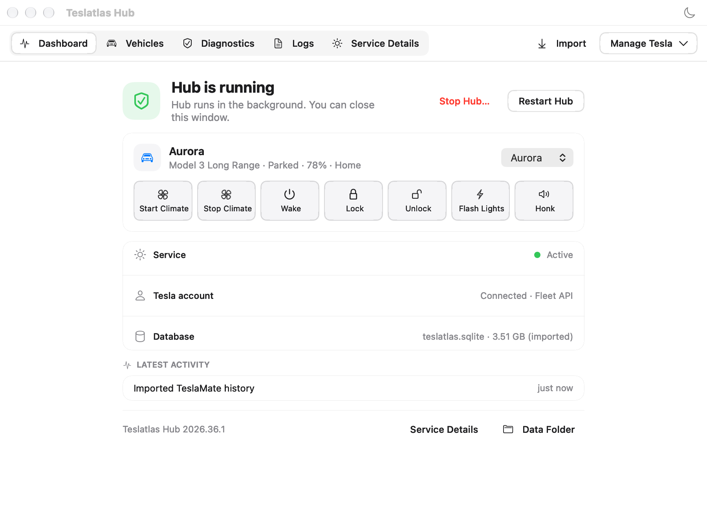

  

<h1 align="center">Teslatlas Hub</h1>

Collect your Tesla vehicle history on your own Mac or Debian host.

  <a href="https://github.com/magrathean-uk/teslatlas-hub/releases/latest">Download</a> ·
  <a href="../docs/guides/getting-started.md">Get started</a> ·
  <a href="../docs/releases/migration.md">Move from TeslaMate</a> ·
  <a href="../docs/index.md">Documentation</a> ·
  <a href="SUPPORT.md">Support</a>

Teslatlas Hub collects vehicle telemetry in the background, stores history
locally, and synchronises it to the separately distributed Teslatlas client.
Use the native Mac app to manage setup, vehicles, diagnostics and logs, or run
Hub as a command-line service on Debian. New installations do not require
TeslaMate, Grafana or MQTT.

*The actual AppKit interface rendered with fictional demonstration data. No
personal account or vehicle data is shown.*

## Download and install

Current release: **2026.36.1**. Download the package for your host:

| Host | Download | Included collection paths | Setup guide |
|---|---|---|---|
| macOS 13+, Apple silicon | [Mac installer](https://github.com/magrathean-uk/teslatlas-hub/releases/download/v2026.36.1/TeslatlasHub-2026.36.1-arm64.pkg) | Legacy and Fleet companions; Fleet configuration required | [Mac setup](../docs/guides/install-macos.md) |
| Debian 13, ARM64 | [ARM64 package](https://github.com/magrathean-uk/teslatlas-hub/releases/download/v2026.36.1/teslatlas-hub_2026.36.1_arm64.deb) | Core/Legacy only | [Debian installation](../docs/guides/install-debian.md) |
| Debian 13, x86-64 | [amd64 package](https://github.com/magrathean-uk/teslatlas-hub/releases/download/v2026.36.1/teslatlas-hub_2026.36.1_amd64.deb) | Core/Legacy only | [Debian installation](../docs/guides/install-debian.md) |

**Current distribution limits:** the Mac app is ad-hoc signed and the installer
is unsigned and unnotarised; macOS may block installation. Use the combined
installer for upgrades, not the in-app service installer. Debian downloads do
not include Fleet companions and must not replace a Fleet deployment without a
separately verified companion plan. Do not disable system-wide security controls.

[Verify downloads](../docs/releases/verification.md) before installing, and
[back up before upgrading](../docs/releases/upgrade.md). The
[release page](https://github.com/magrathean-uk/teslatlas-hub/releases/tag/v2026.36.1)
includes checksums, build evidence and the full release limitations.

## What you can do

- **Keep history on your host.** Hub stores telemetry locally in SQLite-backed
  storage and keeps provider credentials with the resident service.
- **Manage multiple vehicles.** Inspect status and use explicit controls for
  climate, wake, locking, lights and horn where supported by your configuration.
- **Import existing history.** Guided Mac migration connects to TeslaMate over
  SSH without modifying the source database. Review the
  [compatibility and data limits](../docs/releases/migration.md).
- **Check service health.** Use the dashboard, diagnostics and scrollable logs.
- **Connect a client.** Pair the separate Teslatlas client to synchronise history.
- **Plan recovery.** Create data backups and separately encrypted credential
  recovery files using the [backup guide](../docs/operations/backup-and-recovery.md).

## Your first setup

1. **Install** the package for your host and open the Mac app, or follow the
   Debian guide.
2. **Connect or migrate.** Choose a new installation or bring supported
   TeslaMate history across. Fleet requires a developer application and
   receiver configuration; Legacy requires an existing token pair.
3. **Check collection.** Complete diagnostics, start Hub, and confirm the
   intended vehicles and fresh activity. A running process alone does not
   establish that data is arriving.
4. **Pair your client.** Follow [Getting started](../docs/guides/getting-started.md#pair-your-client)
   to prepare a secure connection and create a one-use invitation.

Hub runs independently of its Mac control app. Closing the last app window or
quitting the app does not stop the background service. Use **Stop Hub…** to
pause collection.

## Guides and reference

| I want to… | Read |
|---|---|
| Set up and use the Mac app | [Mac setup and everyday use](../docs/guides/install-macos.md) |
| Run a Debian service | [Debian installation](../docs/guides/install-debian.md) |
| Move from TeslaMate | [Migration](../docs/releases/migration.md) |
| Configure Fleet API and Telemetry | [Fleet setup](../docs/guides/fleet-setup.md) |
| Resolve a problem | [Troubleshooting](../docs/guides/troubleshooting.md) |
| Upgrade or recover | [Upgrade](../docs/releases/upgrade.md) · [Backup](../docs/operations/backup-and-recovery.md) |
| Use the CLI or configure networking | [CLI](../docs/guides/cli.md) · [Configuration](../docs/guides/configuration.md) |
| Understand or contribute to Hub | [Architecture](../docs/architecture/overview.md) · [Contributing](CONTRIBUTING.md) |

For source builds and release reproduction, see the
[release process](../docs/releases/releasing.md). For all guides and policies,
see the [documentation index](../docs/index.md).

## Privacy and support

Vehicle history includes precise locations and other sensitive information.
Keep plaintext HTTP on loopback; remote client connections require TLS and
paired-device authentication. Never expose the internal Telemetry ingestion
route. Review [privacy guidance](../docs/legal/privacy.md) and the
[security model](../docs/architecture/security-model.md).

Start with [Troubleshooting](../docs/guides/troubleshooting.md) and
[Support](SUPPORT.md). Report vulnerabilities privately through
[Security](SECURITY.md). Never post tokens, pairing invitations, VINs, locations
or private databases in an issue.

## Project and licence

Created by **György Bolyki**. Published and maintained by **MAGRATHEAN UK LTD**.
See [authorship and stewardship](../docs/governance/authorship-and-stewardship.md)
and [citation metadata](../CITATION.cff).

Teslatlas Hub is an independent, unofficial project, not affiliated with,
endorsed by or supported by Tesla, Inc. or the official TeslaMate project.
Third-party names and marks belong to their respective owners.

Copyright © 2026 György Bolyki, MAGRATHEAN UK LTD, and identified contributors,
each as applicable to material they own. Hub is free software under
[GNU AGPL version 3 only](../LICENSE), with the permitted section 7 notices in
[additional terms](../docs/legal/additional-terms.md). Third-party material
retains its identified licence. See [Notices](../NOTICE),
[third-party notices](../docs/legal/third-party-notices.md) and
[Corresponding Source](../docs/legal/source-availability.md).

MAGRATHEAN UK LTD · Registered in England and Wales · Company number 16955343 
Registered office: 16 Caledonian Court West Street, Watford, England, WD17 1RY 
[contact@magrathean.uk](mailto:contact@magrathean.uk) · [teslatlas.eu](https://teslatlas.eu)
