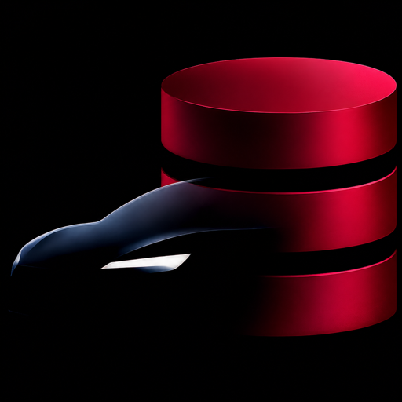

  

<h1 align="center">Teslatlas Hub</h1>

A self-hosted vehicle telemetry collector and local Teslatlas sync hub.

  <a href="../docs/guides/build-from-source.md">Build from source</a> ·
  <a href="../docs/guides/getting-started.md">Get started</a> ·
  <a href="../docs/index.md">Documentation</a> ·
  <a href="SUPPORT.md">Support</a>

Teslatlas Hub collects vehicle telemetry, stores history locally, and synchronises
it with the separately distributed Teslatlas client. The repository contains the
Rust Hub service, a native macOS control app, packaging helpers, and interoperability
fixtures. New installations do not require TeslaMate, Grafana, or MQTT.

## Distribution and candidate targets

Hub is distributed as source. GitHub binary releases and downloadable installer
assets are not provided. Follow the [source build guide](../docs/guides/build-from-source.md)
before using the [Mac](../docs/guides/install-macos.md),
[Debian](../docs/guides/install-debian.md), or
[source-built Docker](../docs/guides/install-docker.md) instructions.

The current candidate targets Apple-silicon macOS 13 or later and Debian 13 on
amd64 or ARM64. Docker is a local source-build path whose architecture and
runtime acceptance depend on the host. Local builds do not automatically have
trusted signing or notarisation. The Mac installer helper currently depends on
the maintained workspace; a standalone clone is not a complete Mac packaging
environment.

## What Hub provides

- Local SQLite-backed vehicle history and resident credential handling.
- Multiple-vehicle status and supported vehicle controls.
- Guided TeslaMate history migration over SSH without modifying the source database.
- Diagnostics, health endpoints, logs, backup, and recovery commands.
- Pairing for the separate Teslatlas client.
- Optional Fleet Telemetry and source-built companion components.

The Mac app controls the background service. Closing the app window does not stop
Hub; use its stop control or the documented service commands when pausing collection.

## First setup

1. Choose a host and build the source package.
2. Follow [Getting started](../docs/guides/getting-started.md) and the host guide.
3. Configure a new collection or import supported TeslaMate history.
4. Complete diagnostics and confirm fresh activity for the intended vehicles.
5. Pair the client using the [client pairing guide](../docs/guides/getting-started.md#pair-your-client).
6. Create and test a recovery copy using [backup and recovery](../docs/operations/backup-and-recovery.md).

## Guides and reference

| Task | Guide |
|---|---|
| Choose a setup path | [Getting started](../docs/guides/getting-started.md) |
| Use the Mac app | [Mac setup](../docs/guides/install-macos.md) |
| Run Debian | [Debian installation](../docs/guides/install-debian.md) |
| Run Docker | [Docker installation](../docs/guides/install-docker.md) |
| Configure Fleet | [Fleet setup](../docs/guides/fleet-setup.md) |
| Use the CLI | [CLI reference](../docs/guides/cli.md) |
| Install companions | [Companion source setup](../docs/guides/companion-setup.md) |
| Diagnose or recover | [Troubleshooting](../docs/guides/troubleshooting.md) · [Backup and recovery](../docs/operations/backup-and-recovery.md) |
| Understand the system | [Architecture](../docs/architecture/overview.md) · [Security model](../docs/architecture/security-model.md) |
| Contribute | [Contributing](CONTRIBUTING.md) |

See the [documentation index](../docs/index.md) for the full guide and policy list.

## Privacy and security

Vehicle history can contain precise locations and other sensitive information.
Keep plaintext HTTP on loopback, use TLS and paired-device authentication for
remote clients, and never expose the internal telemetry ingestion route. Do not
post tokens, invitations, VINs, locations, or private databases in issues. Read
the [privacy guidance](../docs/legal/privacy.md), [security model](../docs/architecture/security-model.md),
and [security policy](SECURITY.md).

## Licence and attribution

Teslatlas Hub was created by **György Bolyki** and is published and maintained by
**MAGRATHEAN UK LTD**. It is an independent, unofficial project and is not
affiliated with, endorsed by, or supported by Tesla, Inc. or the official TeslaMate
project. Third-party names and marks belong to their respective owners.

The Hub is licensed under the [GNU AGPL version 3 only](../LICENSE). The project
uses the permitted section 7 terms in [additional terms](../docs/legal/additional-terms.md).
See [NOTICE](../NOTICE), [third-party notices](../docs/legal/third-party-notices.md),
[Corresponding Source](../docs/legal/source-availability.md), and
[citation metadata](../CITATION.cff) for attribution and source obligations.
