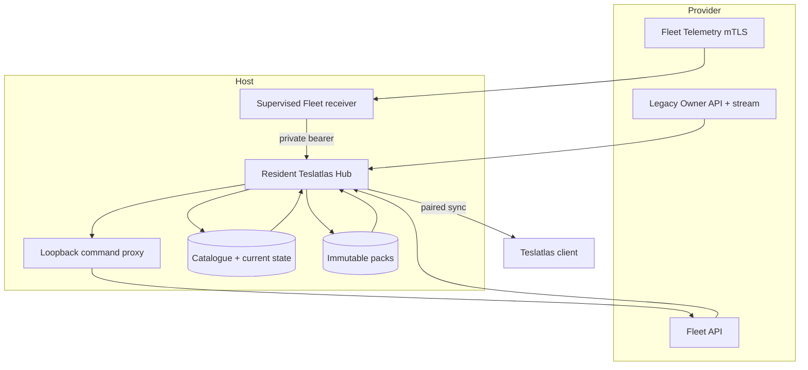

# Architecture

Teslatlas Hub is one Rust process with a local SQLite catalogue, immutable
compressed projection packs, supervised provider collection, and bounded HTTP
sync delivery.

## Ownership boundaries

- The resident Hub process exclusively owns provider credentials and refresh.
- The macOS LaunchAgent or Debian systemd owns Hub process lifecycle.
- The macOS supervisor owns configured companion children. On Debian, Hub's
  systemd unit pulls in configured command-proxy and Fleet-receiver units.
  Explicit Hub stops/restarts propagate to both. Direct transient restarts keep
  healthy companions running; restart exhaustion activates a self-clearing
  target that stops both.
- The receiver acknowledges a record only after Hub accepts it.
- Stopping Hub terminates collection, listeners, and every companion connection.

## Data path

Provider observations are validated and projected into bounded current state,
sessions, and immutable history packs. Credential-like fields are recursively
removed from retained provider envelopes. Raw processing rows are pruned after
projection; Hub is not an unbounded provider-response archive.

The client receives a signed manifest and downloads only referenced,
content-addressed packs. Device pairing and bearer rotation are separate from
provider credentials.

## Migration boundary

TeslaMate migration opens an operator-supplied PostgreSQL source in a read-only
transaction and maps supported TeslaMate 4.1.1 records into Hub-owned storage.
TeslaMate is not bundled, started, stopped, or required after migration.

The explicit `write-back` command is outside migration and collection. It can
update only one selected TeslaMate charging-process cost, starts as a locked-row
dry run, and requires `--apply` to commit.

## Failure model

Database admission, migration, service upgrades, release evidence, and package
validation fail closed. Forward schema migration is a one-way boundary: an old
binary is not restored over a database it may no longer understand.

Network and provider failures use bounded retries. The Debian service also
restarts after an unexpected clean exit, subject to a five-starts-per-five-
minutes limit. Shutdown cancels collection, streaming, HTTP serving, and
supervised children, then allows a short grace period for active requests
before exit.
