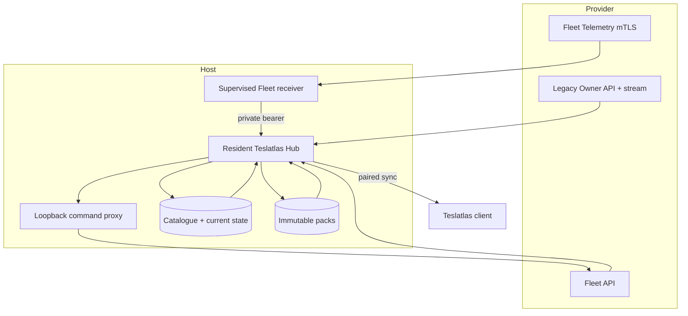

# Architecture

Teslatlas Hub is one Rust process with a local SQLite catalogue, immutable
compressed projection packs, supervised provider collection, and bounded HTTP
sync delivery.

Implementation ownership and file placement are defined in the
[source layout](source-layout.md).

## Ownership boundaries

- The resident Hub process exclusively owns provider credentials and refresh.
- The macOS LaunchAgent or Debian systemd owns Hub process lifecycle.
- The macOS supervisor owns configured companion children. On Debian, Hub's
  systemd unit pulls in configured command-proxy and Fleet-receiver units.
  Explicit Hub stops/restarts propagate to both. Direct transient restarts keep
  healthy companions running; restart exhaustion activates a self-clearing
  target that stops both.
- The receiver acknowledges a record only after Hub accepts it.
- Stopping Hub terminates collection, listeners, and every companion connection.

## Data path

Provider observations are validated and projected into bounded current state,
sessions, and immutable history packs. A successful configured-vehicle discovery
also advances its durable current observation when the provider reports no
lifecycle change; older dynamic telemetry is not presented as newly observed.
Credential-like fields are recursively removed from retained provider envelopes.
Raw processing rows are pruned after projection; Hub is not an unbounded
provider-response archive.

The selected-car TeslaMate importer publishes a complete schema-2.2 PhysicalV3
head from the same exported, read-only PostgreSQL snapshot as its compatibility
projection. For an immediate successor, Hub can also publish a signed Protocol
1.4 changed set with bounded typed rows, removals, projection recomputation
scope, and source context. If that set cannot be represented within its bounds,
the complete signed head remains available for replacement. Older retained
receipts can request a signed full rebase. Hub optionally prepares one completed
UTC month of map tiles bound to the current signed source head; an unavailable
artifact leaves client-side map generation available.

The client receives signed receipts and manifests and downloads only referenced,
content-addressed packs. Device pairing and bearer rotation are separate from
provider credentials.

## Migration boundary

TeslaMate migration opens an operator-supplied PostgreSQL source in an exported,
repeatable-read, read-only transaction and maps supported TeslaMate
v4.2-compatible records into Hub-owned storage. A history-only import can be
repeated while preserving Hub's stored provider credentials; unchanged source
content does not advance the signed physical head. TeslaMate is not bundled,
started, stopped, or required after migration.

The explicit `write-back` command is outside migration and collection. It can
update only one selected TeslaMate charging-process cost, starts as a locked-row
dry run, and requires `--apply` to commit.

## Failure model

Database admission, migration, service upgrades, release evidence, and package
validation fail closed. Forward schema migration is a one-way boundary: an old
binary is not restored over a database it may no longer understand.

Network and provider failures use bounded retries. The Debian service also
restarts after an unexpected clean exit, subject to a five-starts-per-five-
minutes limit. Shutdown cancels collection, streaming, HTTP serving, and
supervised children, then allows a short grace period for active requests
before exit.
