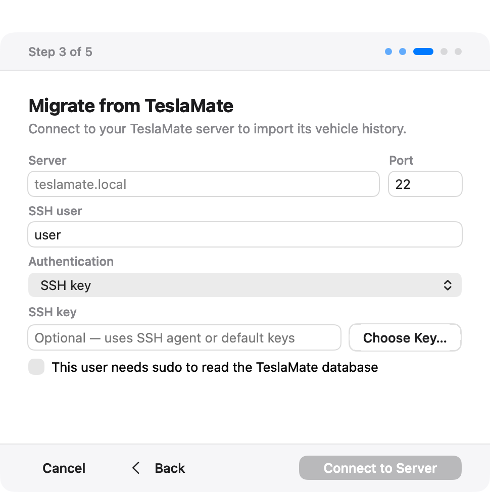

# Mac setup and everyday use

Teslatlas Hub 2026.36.1 targets Apple-silicon Macs running macOS 13 or
later.

Build your own package using [Build from source](build-from-source.md).
Prebuilt GitHub releases are no longer provided. By default the app is ad-hoc signed
and the combined installer is unsigned and unnotarised. Use the combined
installer for installation and upgrades; in-app service installation,
reinstallation, and update are unavailable in this distribution. The embedded
installer requires official-release metadata and Gatekeeper trust, which this
build does not provide. The unsigned installer can be blocked by macOS or
organisation policy. Do not disable system-wide security controls to install it.
For an existing installation, follow [Upgrade and rollback](../releases/upgrade.md).

## Install

1. Open your locally built `dist/TeslatlasHub.pkg`.
2. Complete the macOS Installer flow. It installs **Teslatlas Hub.app** in
   `/Applications` and the service payload in
   `/Library/Application Support/Teslatlas Hub`.
3. Open `/Applications/Teslatlas Hub.app`.
4. Choose Fleet API, legacy login, or TeslaMate migration.
5. Complete account setup and diagnostics.
6. Confirm the dashboard reports **Hub is running**, diagnostics pass, and
   the intended vehicles and fresh activity are visible. Process health alone
   does not prove that new vehicle data is arriving.

## Connect or migrate

For a new installation, choose **New installation** in setup. Fleet requires
your Tesla Developer application and the configuration described in
[Fleet setup](fleet-setup.md). Legacy requires an existing Owner API token
pair. Do not leave another service refreshing the same Legacy credentials.

To bring existing history across, choose **Migrate from TeslaMate** and follow
the [migration checklist](../releases/migration.md#before-you-start). Enter the
server, SSH port and user. Select **SSH key** and use **Choose Key…** to select
your private key, or select **Password** for that authentication path. Leaving
the key field empty uses the SSH agent or default keys. Do not choose the
public key ending in `.pub` or share the private key with support.

Select **This user needs sudo to read the TeslaMate database** only when the
server account needs that access. Read the compatibility confirmation before
importing. Keep TeslaMate and its backup until you have verified the imported
history and completed the explicit cutover step.



*Actual AppKit interface with fictional demonstration data.*

If a step fails, read its message and open logs before retrying. Authentication,
Docker access and schema compatibility are different failures; changing a
password will not fix a schema rejection. See [Troubleshooting](troubleshooting.md).

## Everyday use

| Control | What it does |
|---|---|
| Dashboard | Shows service, account, database, selected vehicle and recent activity |
| Vehicles | Shows connected vehicles and available command controls |
| Diagnostics | Opens checks and a **Run Again** action |
| Logs | Opens a separate, resizable window with scrolling, Copy and Save |
| Service Details | Shows service information and uninstall controls |
| Manage Tesla | Offers connection changes and migration actions |

Vehicle commands affect the real vehicle. Use only the intended action and
review any confirmation; do not send commands merely to test the interface.

### Close, quit or stop collection

- **Command-W** or the window's red close control closes that window. Closing
  the last app window exits the control app, not the background service.
- **Command-Q** or **Quit Teslatlas Hub** quits the control app. An active
  protected setup/import operation may need to finish first; the app explains
  this instead of interrupting the operation.
- **Stop Hub…** stops the service and pauses collection. **Restart Hub**
  restarts the service. Quitting the app is not a substitute for stopping Hub.
- **Command-L** opens logs. Return activates the enabled default action where
  one is provided. Use the Edit menu shortcuts to work with text fields.

The host must remain available for collection; closing the app does not make
an asleep or powered-off Mac collect data. For client connection instructions,
see [Pair your client](getting-started.md#pair-your-client).

## How the service is installed

The product installer includes both the app and a service-only component. The
app also carries `Contents/Resources/TeslatlasHubService.pkg`, but this
distribution cannot install that embedded package through the app. Use the
combined installer to install or update the service. A
per-user LaunchAgent owns the running Hub service for the signed-in user.

The app keeps Hub stopped when setup, version admission, package verification,
or diagnostics fail. It never silently starts an unconfigured collector.

## Service controls

Use the app, or run the installed binary by its absolute path. The package does
not add a shell command to `PATH`:

```sh
HUB='/Library/Application Support/Teslatlas Hub/bin/teslatlas-hub'
CONFIG="$HOME/Library/Application Support/Teslatlas Hub/config.toml"
"$HUB" service status
"$HUB" --config "$CONFIG" service start
"$HUB" --config "$CONFIG" service restart
"$HUB" service stop
```

Stopping Hub pauses collection and closes streaming, HTTP, command-proxy, and
supervised companion connections. Stored history remains intact.

## Logs and diagnostics

Press **Command-L** in the app to open bounded, redacted app and service logs.
**Run Diagnostics** performs `doctor`, `preflight`, `status`, database,
credential, connection, and recent-log checks.

Copy and Save use the same redaction pass. Review every report before sharing
it; precise telemetry is sensitive even when ordinary identifiers are removed.

## Uninstall

Open **Service Details → Uninstall Hub…**. The default uninstall removes the
current user's LaunchAgent, service payload, and logs but preserves the Hub
database and configuration. Permanent data deletion is a separate confirmed
choice.

The uninstaller refuses to remove a shared service payload while another local
user still has a Hub LaunchAgent.

## Build from source

For developers building from source, follow the toolchain and packaging
requirements in the [release process](../releases/releasing.md). From a source
checkout of `main` (or a historical tag when reproducing it), the combined installer entry point is:

```sh
./scripts/build-macos-app.sh
```

See the [source build guide](build-from-source.md). Source builds do not
automatically gain trusted signing or notarisation.
